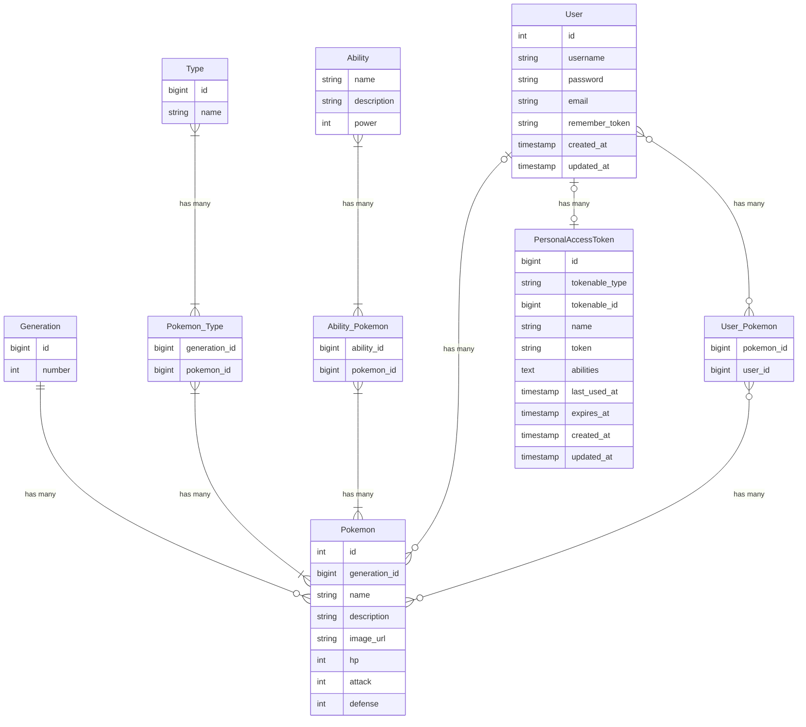

## Introduction

This project is initiated at the request of Professor Oak, the leading researcher in
Pokémon studies, to enhance the Pokémon Customization Platform. The Digital Pokémon
Crafters software team is assigned the task of developing a custom Pokémon API that
integrates with the existing platform.

The Digital Pokémon Crafters' Custom Pokémon API aims to enable users to generate entirely
unique Pokémon based on seed phrases, leveraging the OpenAI ChatGPT API and the Dal-e API.
This API will play a crucial role in enhancing the platform's capabilities, providing
users with personalized and visually appealing custom Pokémon.
Goal

The goal of the Custom Pokémon API is to seamlessly integrate with the Pokémon
Customization Platform, allowing users to generate personalized Pokémon based on unique
seed phrases. The API should efficiently communicate with the OpenAI ChatGPT and Dal-e
APIs to deliver a comprehensive and engaging Pokémon customization experience.

This project facilitates exploring the space of possible Pokémon by generating plausible
yet hypothetical Pokémon. In this way, we help Pokémon researchers and philosophers better
understand our place in this Pokémon world.

## Target Users

The target users of the Custom Pokémon API include Pokémon enthusiasts using the Pokémon
Customization Platform. These users will leverage the API to generate custom Pokémon based
on their seed phrases, enhancing their overall experience on the platform. 

## Scope

### Must Have:

-   Pokémon Generation: Implement a mechanism for generating custom Pokémon based on seed
    phrases.
-   API Integration: Communicate effectively with the OpenAI ChatGPT (and optinally Dal-e or
    similar APIs) to obtain textual and visual information for custom Pokémon generation.
-   Seed Phrase Input: Allow users to input seed phrases for personalized Pokémon
    generation.

### Should Have:

-   Pokémon Repository: Store generated Pokémon data for future retrieval and reference.
-   Pokémon image generation: Communicate with the Dal-e (or similar image generation AI)
    api to create a matching image for the custom Pokémon.
-   Error Handling: Implement robust error handling mechanisms for API interactions.

### Might Have:

-   User Profiles: Allow users to create profiles and save their favourite generated
    Pokémon.
-   Batch Pokémon Generation: Enable the generation of multiple Pokémon based on a list of
    seed phrases.

### Will Not Have:

-   Advanced AI Analytics: In-depth analysis of AI-generated Pokémon characteristics is out of
    scope for the initial version.
-   Social Media Integration: Integrating with external social media platforms for sharing
    Pokémon is not part of the initial scope.

## User Stories

| As a (role): | In order to:                                                                               | I want:                                             | Deliverable:                | Story points: |
| :----------- | :----------------------------------------------------------------------------------------- | :-------------------------------------------------- | :-------------------------- | :------------ |
| User         | Customize Pokémon based on a seed phrase                                                   | A user-friendly API endpoint for Pokémon generation | PHP Laravel API             | 30            |
| User         | Retrieve generated Pokémon data                                                            | Access to a comprehensive API for data retrieval    | PHP Laravel API             | 30            |
| Developer    | Have an overview of the project, requirements, wishes, constraints, technologies, planning | A project plan.                                     | project_plan.md             | 8             |
| Developer    | Have quick and easy stakeholder onboarding                                                 | A project readme.                                   | readme.md                   | 6             |
| Developer    | Have quick and easy developer onboarding                                                   | Set up instructions in the project readme.          | bullet point list in readme | 6             |

## Planning

| Day: | Task:                        | Team members:     | Deliverable:                                                       |
| :--- | :--------------------------- | :---------------- | :----------------------------------------------------------------- |
| 1    | API Planning and Design      | All               | API design document and initial planning summaries                 |
| 1    | Set up Laravel project       | Wessel            | A fully configured Laravel project ready for API development       |
| 2    | Pokémon Repository           | Raymon & Jonathan | Set up storage and retrieval mechanism for generated Pokémon       |
| 2    | Seed Phrase Endpoint         | Raymon            | Implement API endpoint for generating Pokémon based on seed phrase |
| 3    | API Integration with ChatGPT | Wessel & Gilbert  | Integrate with OpenAI ChatGPT API for textual Pokémon generation   |
| 4    | API Integration with Dal-e   | Wessel & Gilbert  | Integrate with Dal-e API for visual representation of Pokémon      |
| 5    | User Authentication          | Raymon            | Implement basic user authentication for tracking users             |
| 6    | Error Handling               | Shazib            | Implement robust error handling for API interactions               |
| 6    | User Profiles                | Shazib            | Allow users to create profiles and save favourite Pokémon          |

## Technologies

The Custom Pokémon API will be built in PHP 8.2, using the Laravel framework version 10.
It will communicate with a MariaDB version 11 database server. The API will be served
using the Apache web server.
Laravel sanctum will be used to aid in API authentication, the official Open-API PHP
client will be used to connect with the OpenAI API.

## Endpoints specification

-   Generate a custom Pokémon based on a seed phrases:

          POST /api/generate

-   Retrieve details of a (generated) Pokémon:

          GET /api/pokemon/{id}

-   Search (generated) Pokémon by name/kind:

          GET /api/pokemon/{query}

-   Retrieve a list of Pokémon generated by a specific user:

          GET /api/pokemon/user/{userId}

-   Register a new user for tracking Pokémon customization:

          POST /api/user/register

## Data Model

This diagram outlines the initial design of core entities, allowing for efficient Pokémon
customization and user tracking. The database schema is expected to change as the team's
understanding of the problem space increases.
